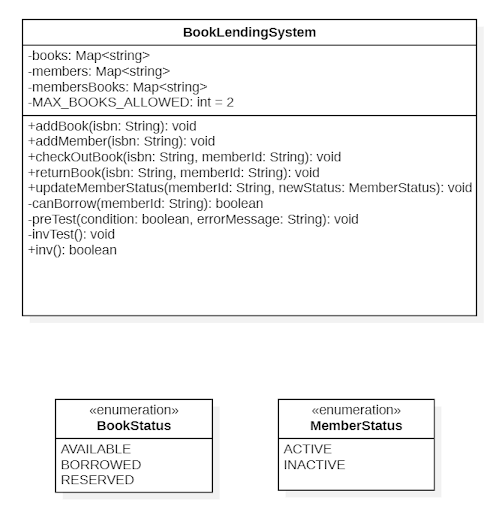
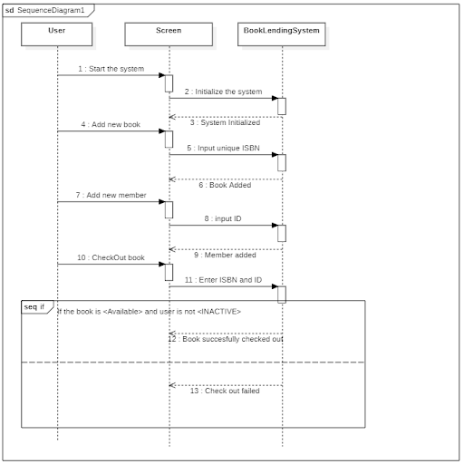
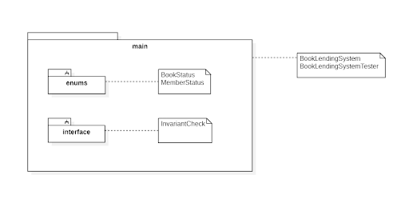
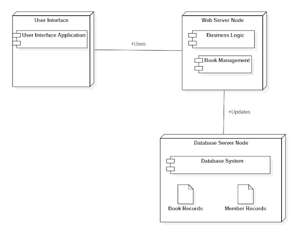
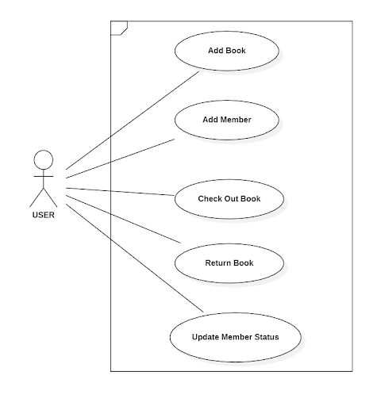

# Book Lending System (BLS)

## Introduction
The Book Lending System (BLS) is an automated solution designed to efficiently manage book circulations within libraries. It simplifies the process of book lending, returns, and tracking, providing a seamless experience for both librarians and members.

## Features
- Real-time updates on book availability
- Automated return processes
- User-friendly interface for librarians

## Technology Stack
- Java code

## Architecture
This project adopts the 4+1 architectural model, including:
- Logical view
- Development view
- Process View
- Physical view
- Scenarios

### Class Diagram
The class diagram illustrates the structure of the system showing the system classes, their attributes, operations (or methods), and the relationships among objects.

### Sequence Diagram
The sequence diagram shows how objects operate with one another and in what order. It represents the flow of messages, events, and actions between objects or components.

### Package Diagram
The package diagram depicts the dependencies between the packages that make up the BLS, illustrating the system's modular structure.

### Deployment Diagram
This diagram shows the physical deployment of artifacts on nodes. For the BLS, it illustrates how the software is distributed across different servers.

### Use Case Diagram
The use case diagram provides a graphical overview of the goals modeled by an actor and a set of use cases defined for a system.

